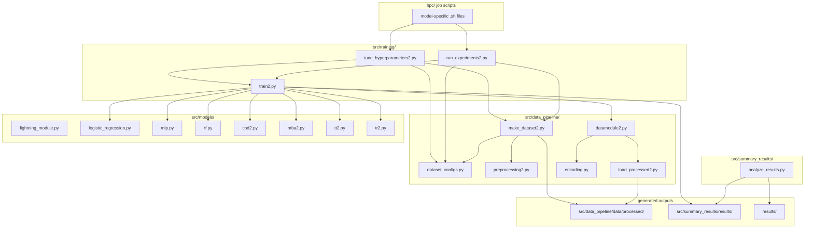

# Code Dependency Diagram

```mermaid
flowchart TD
    subgraph HPC["hpc/ job scripts"]
        JOBS["model-specific .sh files"]
    end

    subgraph Training["src/training/"]
        TUNE["tune_hyperparameters2.py"]
        RUNEXP["run_experiments2.py"]
        TRAIN["train2.py"]
    end

    subgraph DataPipeline["src/data_pipeline/"]
        CONFIGS["dataset_configs.py"]
        MAKE["make_dataset2.py"]
        PREP["preprocessing2.py"]
        LOAD["load_processed2.py"]
        DATAMOD["datamodule2.py"]
        ENC["encoding.py"]
    end

    subgraph Models["src/models/"]
        LIGHTNING["lightning_module.py"]
        LR["logistic_regression.py"]
        MLP["mlp.py"]
        RF["rf.py"]
        CPD["cpd2.py"]
        MBA["mba2.py"]
        TT["tt2.py"]
        TR["tr2.py"]
    end

    subgraph Analysis["src/summary_results/"]
        ANALYZE["analyze_results.py"]
    end

    subgraph Generated["generated outputs"]
        PROCESSED["src/data_pipeline/data/processed/"]
        LOGS["src/summary_results/results/"]
        REPORT["results/"]
    end

    JOBS --> TUNE
    JOBS --> RUNEXP

    TUNE --> CONFIGS
    TUNE --> MAKE
    TUNE --> TRAIN

    RUNEXP --> CONFIGS
    RUNEXP --> MAKE
    RUNEXP --> TRAIN

    MAKE --> CONFIGS
    MAKE --> PREP
    MAKE --> PROCESSED

    TRAIN --> DATAMOD
    TRAIN --> LR
    TRAIN --> MLP
    TRAIN --> RF
    TRAIN --> CPD
    TRAIN --> MBA
    TRAIN --> TT
    TRAIN --> TR
    TRAIN --> LOGS

    DATAMOD --> LOAD
    DATAMOD --> ENC
    LOAD --> PROCESSED

    ANALYZE --> LOGS
    ANALYZE --> REPORT
```
