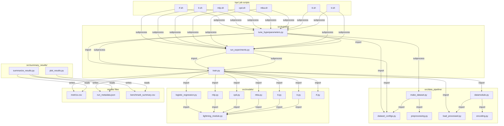

# Code Dependency Diagram

```mermaid
flowchart TD
    subgraph HPC["hpc/ job scripts"]
        RF_SH[rf.sh]
        LR_SH[lr.sh]
        MLP_SH[mlp.sh]
        CPD_SH[cpd.sh]
        MBA_SH[mba.sh]
        TT_SH[tt.sh]
        TR_SH[tr.sh]
    end

    subgraph Training["src/training/"]
        TUNE[tune_hyperparameters.py]
        RUNEXP[run_experiments.py]
        TRAIN[train.py]
    end

    subgraph DataPipeline["src/data_pipeline/"]
        CONFIGS[dataset_configs.py]
        MAKE[make_dataset.py]
        PREP[preprocessing.py]
        LOAD[load_processed.py]
        DATAMOD[datamodule.py]
        ENC[encoding.py]
    end

    subgraph Models["src/models/"]
        LIGHTNING[lightning_module.py]
        LR_M[logistic_regression.py]
        MLP_M[mlp.py]
        CPD_M[cpd.py]
        MBA_M[mba.py]
        TT_M[tt.py]
        TR_M[tr.py]
        RF_M[rf.py]
    end

    subgraph Summary["src/summary_results/"]
        SUMM[summarize_results.py]
        PLOT[plot_results.py]
    end

    subgraph Files["results/ files"]
        METRICS[metrics.csv]
        META[run_metadata.json]
        BENCHSUM[benchmark_summary.csv]
    end

    RF_SH  -->|subprocess| TUNE & RUNEXP
    LR_SH  -->|subprocess| TUNE & RUNEXP
    MLP_SH -->|subprocess| TUNE & RUNEXP
    CPD_SH -->|subprocess| TUNE & RUNEXP
    MBA_SH -->|subprocess| TUNE & RUNEXP
    TT_SH  -->|subprocess| TUNE & RUNEXP
    TR_SH  -->|subprocess| TUNE & RUNEXP

    TUNE -->|import| CONFIGS & RUNEXP & TRAIN
    TUNE -->|subprocess| MAKE & TRAIN

    RUNEXP -->|import| CONFIGS & TRAIN
    RUNEXP -->|subprocess| TRAIN

    TRAIN -->|import| DATAMOD & LOAD
    TRAIN -->|import| LR_M & MLP_M & CPD_M & MBA_M & TT_M & TR_M & RF_M
    TRAIN -->|writes| METRICS & META

    DATAMOD -->|import| LOAD & ENC
    MAKE    -->|import| CONFIGS & PREP

    LR_M  -->|import| LIGHTNING
    MLP_M -->|import| LIGHTNING
    CPD_M -->|import| LIGHTNING
    MBA_M -->|import| LIGHTNING
    TT_M  -->|import| LIGHTNING
    TR_M  -->|import| LIGHTNING

    SUMM -->|reads| METRICS & META
    SUMM -->|writes| BENCHSUM
    PLOT -->|reads| BENCHSUM
```